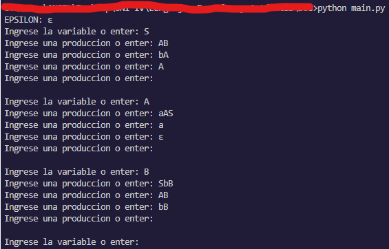
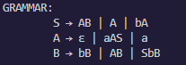
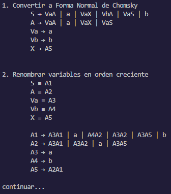
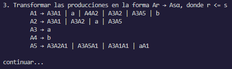
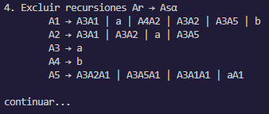
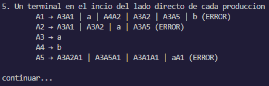
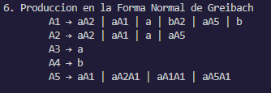

# Forma Normal de Greibach

---

1. [Introducción](#introducción)
1. [Instalación](#instalacion)
1. [Requisitos del sistema](#requisitos-de-sistema)
1. [Uso del programa](#uso-del-programa)
   - [Interfaz de usuario](#interfaz-de-usuario)
   - [Ejemplo de Uso](#ejemplo-de-uso)
   - [Ejemplos de Demostración](#ejemplos-de-demostración)
1. [Soporte técnico](#soporte-técnico)
1. [Tiempo de respuesta](#tiempo-de-respuesta)
1. [Contribuidores](#contribuidores)

---

## Introducción

La Forma Normal de Greibach (Greibach Normal Form o GNF) es una forma normal utilizada en la teoría de la computación y gramáticas formales. Fue propuesta por el matemático alemán Sheila Greibach. El propósito de la Forma Normal de Greibach es estandarizar y simplificar gramáticas libres de contexto.

En esta forma normal, todas las producciones de la gramática tienen una estructura específica. Una gramática se dice que está en GNF si todas sus producciones son de la forma:

A → a α

donde:

- A es un símbolo no terminal.
- a es un símbolo terminal.
- α es una secuencia de símbolos terminales y no terminales, pero no puede ser vacía.

La Forma Normal de Greibach facilita el análisis sintáctico y la implementación de algoritmos en compiladores. Aunque no es la forma normal más comúnmente utilizada, como la Forma Normal de Chomsky o la Forma Normal de Backus-Naur, la GNF tiene sus propias aplicaciones y ventajas en ciertos contextos.

## Instalacion

1. Clona el repositorio:

   ```bash
   git clone https://github.com/angelchavezinformatica/greibach.git
   cd greibach
   ```

## Requisitos de Sistema

- Python 3.9 o superiores.

## Uso del Programa

### Interfaz de usuario

- Ejecutando el siguiente comando en el directorio del programa puede empezar a usar el programa.

  ```bash
  python main.py
  ```

### Ejemplo de Uso

- Entrada de usuario:

  
  En este caso **ε** es la cadena vacía

- Gramatica resultante:

  

- Pasos:

  

  

  

  

  

### Ejemplos de Demostración

- Ejecutando el siguiente comando tiene acceso a 5 ejemplos.

  ```bash
  python main.py --test
  ```

## Soporte Técnico

### Plataforma de Soporte

- Correo Electrónico: achavezg@unitru.edu.pe

## Tiempo de Respuesta

Haremos todo lo posible para responder a tus consultas en un plazo de 48 horas.

¡Gracias por utilizar nuestro Conversor de Gramática a Forma Normal de Greibach!

### Contribuidores

- Chávez García Angel Emanuel
- Mostacero Bazan Kevin Alejandro
- Sánchez Abanto Félix Aladino
